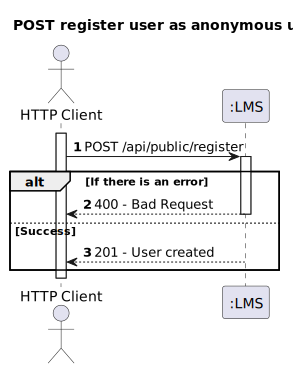

# Register User

## 1. Requirements Engineering

### 1.1. User Story Description

**As an Anonymous User,** I want to register a new account by providing my details.

### 1.2. Found out Dependencies

- The user must provide valid registration details such as username, password.

### 1.3 Input and Output Data

**Input Data:**
- Typed data:
  - Username
  - Password

**Output Data:**
- (In)success of the registration operation, possibly including a confirmation email.

## 2. Design

### 2.1. Process View

#### 2.1.1. Level 1

#### 2.1.2. Level 2

#### 2.1.3. Level 3

