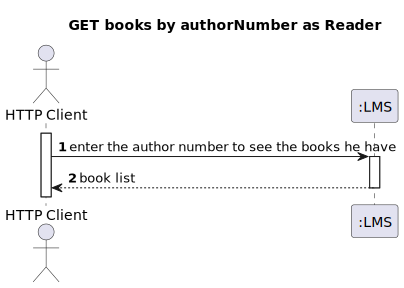
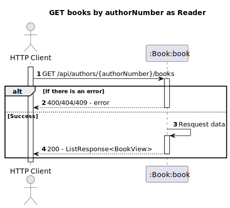
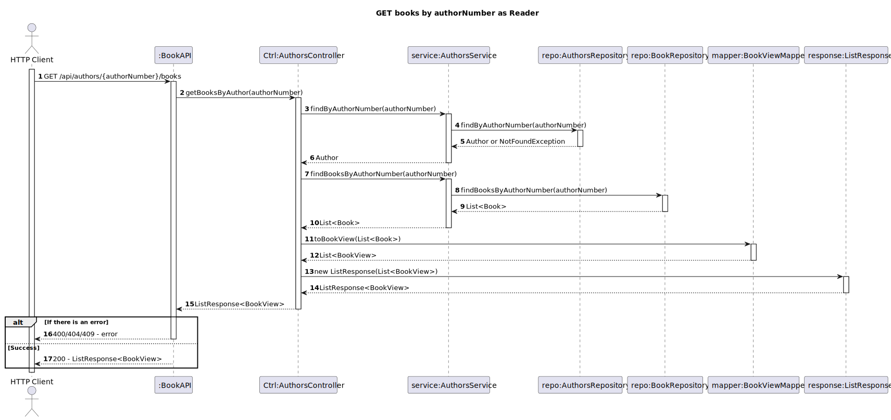

# US11 - Know the books of an Author

## 1. Requirements Engineering
### 1.1. User Story Description

As Reader I want to know the books of an Author

### 1.2. Acceptance Criteria
- Deve retornar a lista de livros desse autor ou uma lista vazia. Devem ter em consideração paginação se a lista for demasiado longa

### 1.3. Found out Dependencies
- The reader must be authenticated in the system
- Books repository
- Authors repository
### 1.4. Input and Output Data

**Input Data:**

* Typed data:
  * Authors number

**Output Data:**

* Books of an author
* (In)success of the operation

## 2. Design
### 2.1. Process View
#### 2.1.1. Level 1

#### 2.1.2. Level 2

#### 2.1.3. Level 3

## 3. Observations
It was assumed, in response to this user story,
that the author search was conducted using the
only unique attribute they have. This attribute is
the author number, which is why it is implemented
this way.

