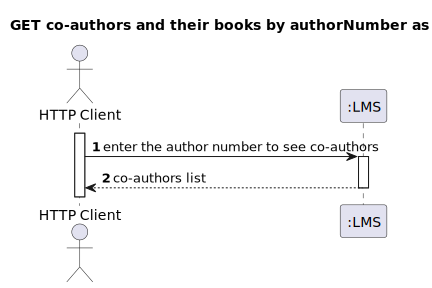
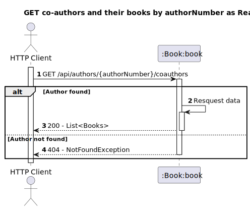
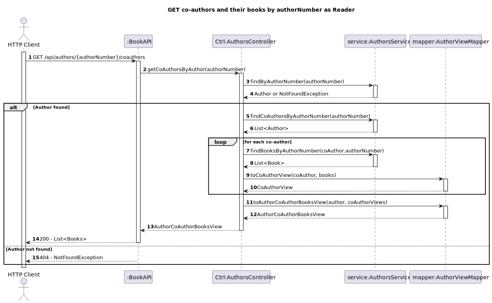

# US12 - Authors - Know the co-authors of an author and their respective books

## 1. Requirements Engineering
### 1.1. User Story Description
As Reader I want to know the co-authors of an author and their respective books

### 1.2. Acceptance Criteria
- Deve retornar uma lista com os autores que escreveram livros em conjunto com um dado autor. para cada coautor deve ser retornada alista de livros escritos em conjunto. devem ter em consideração paginação se a lista for demasiado longa

### 1.3. Found out Dependencies
- The reader must be authenticated in the system
- Books repository
- Authors repository
### 1.4. Input and Output Data

**Input Data:**

* Typed data:
  * Author name

**Output Data:**

* Co-authors of an author and their respective books
* (In)success of the operation

## 2. Design
### 2.1. Process View
#### 2.1.1. Level 1

#### 2.1.2. Level 2

#### 2.1.3. Level 3

