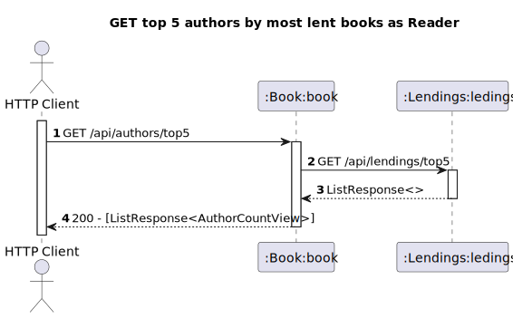

# US13 - As Reader I want to know the Top 5 authors which have the most lent books

## 1. Requirements Engineering
### 1.1. User Story Description

As Reader I want to know the Top 5 authors (which have the most lent books)

### 1.2. Acceptance Criteria
- Deve retornar os 5 autores com o maior numero de livros requisitados no ultimo ano

### 1.3. Found out Dependencies
- The reader must be authenticated in the system
- Lendings management
- Books repository
- Authors repository
### 1.4. Input and Output Data

**Input Data:**

* Typed data:
   - request to find out the top 5 authors whose books are most lending

**Output Data:**

* Top 5 authors 
* (In)success of the operation

## 2. Design
### 2.1. Process View
#### 2.1.1. Level 1

#### 2.1.2. Level 2

#### 2.1.3. Level 3
