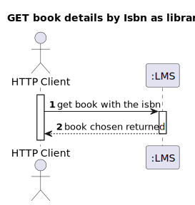
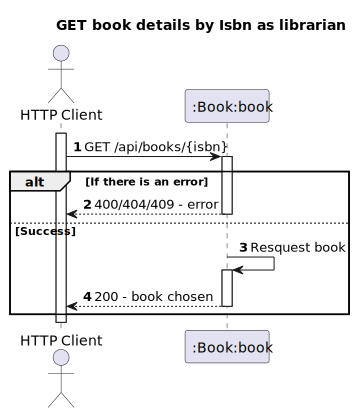
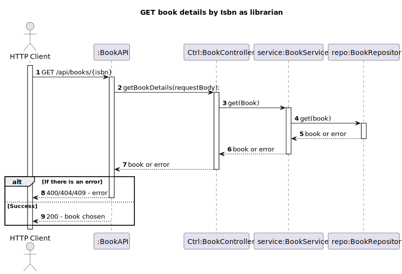

# US3 - Get the details of the Books
## 1. Requirements Engineering
### 1.1. User Story Description
As Librarian, I want to get the details of a book given its ISBN(isbn, title, genre, description, author(s))

### 1.2. Found out Dependencies
- The Libarian or Reader must be authenticated in the system
### 1.3. Input and Output Data
- The librarian or Reader needs to give the ISBN of the book
  **Input Data:**
* Typed data:
    * ISBN

**Output Data:**

* (In)success of the operation

## 2. Design
### 2.1. Process View
#### 2.1.1. Level 1

#### 2.1.2. Level 2

#### 2.1.3. Level 3

