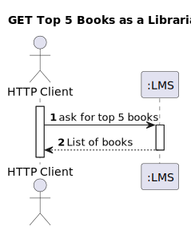
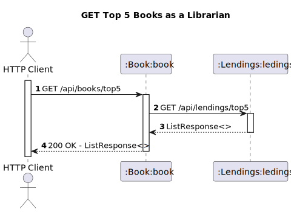
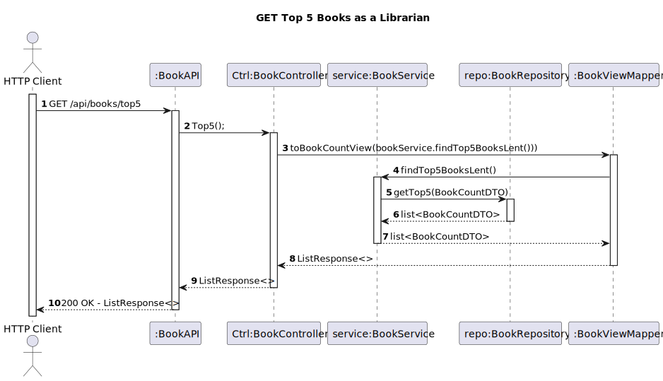

# WP #1B - Authors - As Reader I want to know the Top 5 authors which have the most lent books

## 1. Requirements Engineering
### 1.1. User Story Description

As Reader I want to know the Top 5 Book Lent (which have the most lent books)

### 1.2. Acceptance Criteria
- returns the list of the 5 books that have been lent the most in the last year. it must return for each book, the number of times the book has been lent. the result must be sorted descending order.

### 1.3. Found out Dependencies
- Books 
- Lendings
- 
### 1.4. Input and Output Data

**Input Data:**

* Typed data:
   - request to find out the top 5 books lent

**Output Data:**

* Top 5 books 
* (In)success of the operation

## 2. Design
### 2.1. Process View
#### 2.1.1. Level 1

#### 2.1.2. Level 2

#### 2.1.3. Level 3

