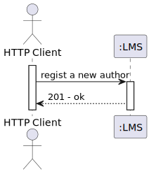
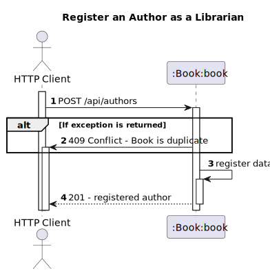

# US7 – Register Authors
## 1. Requirements Engineering
### 1.1. User Story Description
As Librarian I want to register an author (name, short bio).

### 1.2. Found out Dependencies
- The Librarian must be authenticated in the system
### 1.3. Input and Output Data
- The librarian needs to give all the details to register the book
  **Input Data:**
* Typed data:
    * Name
    * Description

**Output Data:**

* (In)success of the operation

## 2. Design
### 2.1. Process View
#### 2.1.1. Level 1

#### 2.1.2. Level 2

#### 2.1.3. Level 3

