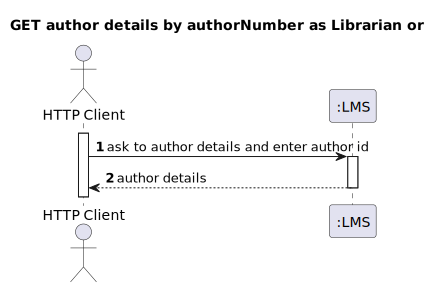
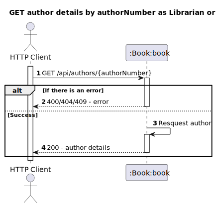
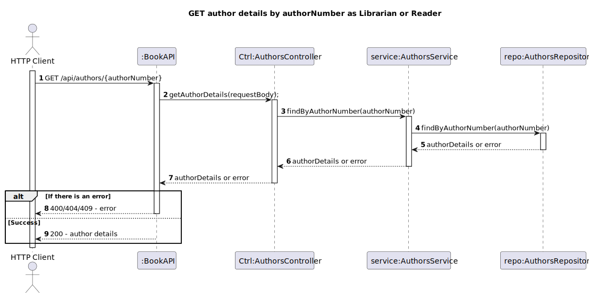

# US9 – Know Author's Details
## 1. Requirements Engineering
  ### 1.1. User Story Description
As Librarian or Reader I want to know an author’s detail given its author number.

### 1.2. Found out Dependencies
- The Librarian/Reader must be authenticated in the system
### 1.3. Input and Output Data
- The librarian/Reader needs to enter de author number
  **Input Data:**
* Typed data:
    * Author Details

**Output Data:**

* (In)success of the operation

## 2. Design
### 2.1. Process View
#### 2.1.1. Level 1

#### 2.1.2. Level 2

#### 2.1.3. Level 3
