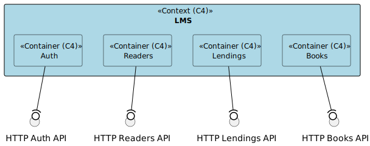
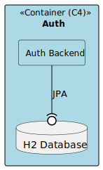
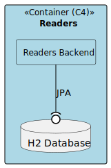
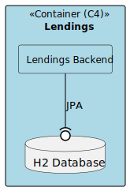
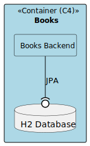
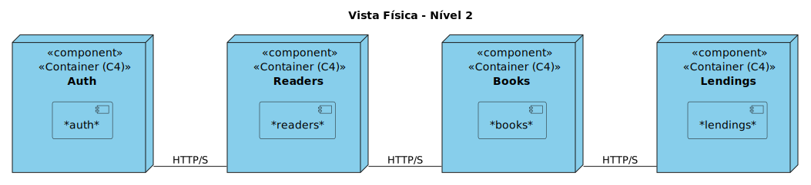

# Logical View of LMS #

In this file, the new division of the previously completed project from the PSOFT course will be shown according to the C4x(4+1) model. This project will be divided into four separate groups, which will be presented throughout the document, and all the logical views will also be shown, including logical view 1, 2, and 3.

### Explanation of the decisions taken: ###

Considering the previous project and the context of the Distributed Systems course, we defined the following groupings:
* Lendings and Fine (Lendings)
* Books, Author, and Genre (Books)
* User/Auth (Auth)
* Readers (Readers)

### Logical View Representation ###
#### Nível 1: ####

#### Nível 2: ####

#### Nível 3: ####

##### Auth: #####

##### Readers: #####

##### Lendings: #####

##### Books: #####

### Physic View Representation ###
#### Nível 2: ###

